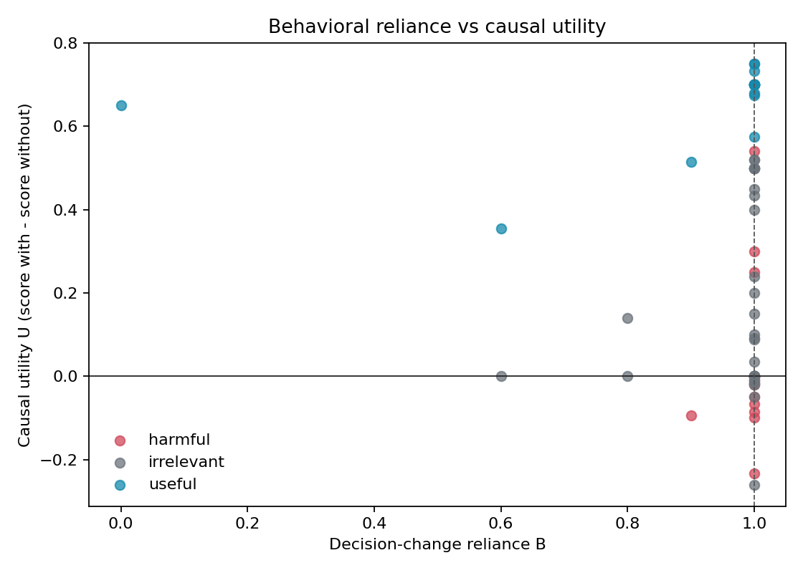
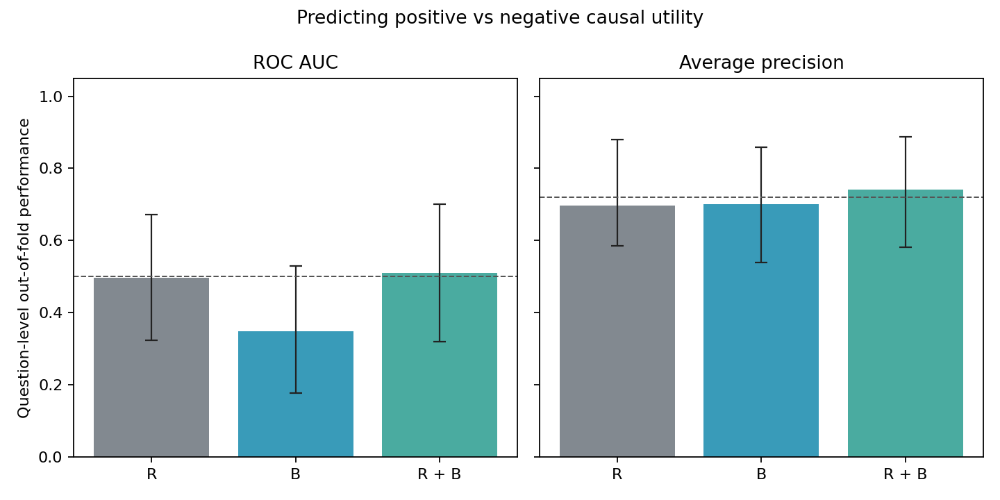
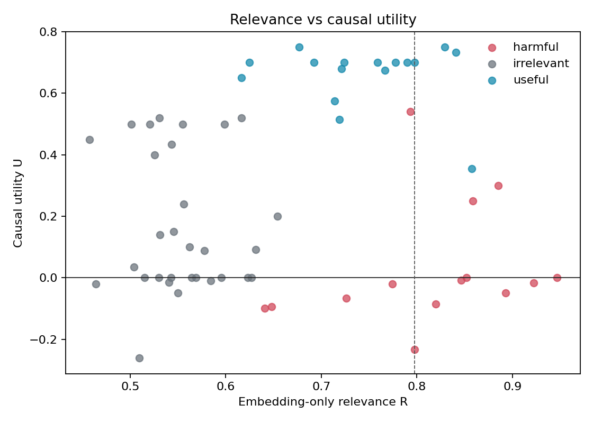

# CMI Motivation Pilot: Causal Utility Report

## 1. Executive Summary

本实验检验一个核心问题：memory 与问题的相关性，或模型对 memory 的行为依赖，能否在不直接估计 causal utility 的情况下，预测该 memory 最终是有帮助还是有害。

本次实验包含20个问题、60次单条 memory 干预，每个条件进行5次 rollout。生成模型为 `qwen2.5:7b`，judge 模型为独立的 `llama3:8b`，embedding 模型为 Ollama 的 `nomic-embed-text`。全部60条干预成功完成，没有跳过问题，也没有无效 judge 输出。

主要结论如下：

1. Embedding relevance 与 causal utility 的总体相关性很弱，cluster bootstrap 区间跨过0。
2. 在 harmful、irrelevant、useful 三个标签内部，relevance 与 utility 的相关性同样都没有得到统计支持。
3. Behavioral reliance 与 utility 几乎没有相关性。
4. 只用 relevance、只用 behavioral reliance，或联合使用二者，都不能可靠预测 utility 的正负方向。
5. 本次 (B) 几乎饱和在1：53/60条干预的 (B=1)，因此当前 decision-change judge 更像一个“是否发生明显改变”的指标，而不是连续的 reliance 强度指标。

因此，实验支持 CMI 的核心动机：不能把 retrieval relevance 或行为变化 proxy 直接当作 memory 的 causal utility，仍需要专门的 utility estimator 或人工/独立评估。

## 2. Experimental Setup

### 2.1 Models and data

| 项目 | 配置 |
|---|---|
| Dataset | `causal_locomo_final.jsonl` |
| Questions | 20 |
| Retrieved memories | 每题 Top-3 |
| Interventions | 60 |
| Rollouts | 每个条件5次 |
| Agent | `qwen2.5:7b` |
| Judge | `llama3:8b` |
| Embedding | `nomic-embed-text` |
| Generation temperature | 0.3 |
| Retrieval metric | hybrid |
| Analysis relevance | embedding-only |
| Utility score | deterministic + Llama judge，各50% |
| Behavioral score | Llama decision-change judge |
| Perturbation | disabled |

memory 构造标签为 `useful`、`harmful` 和 `irrelevant`。这些标签是在数据构造阶段指定的角色，不是根据实验结果中的 (U) 事后定义的。

### 2.2 Three measurements

Embedding relevance：

\[
R_i = \operatorname{cosine}(embedding(q), embedding(m_i))
\]

Behavioral reliance：

\[
B_i = D(y_{with(m_i)}, y_{without})
\]

其中 (B=0) 表示 judge 认为没有实质决策变化，(B=1) 表示实质变化，中间值表示部分变化。

Causal utility：

\[
U_i = score(y_{with(m_i)}) - score(y_{without})
\]

其中 (U>0) 表示 memory 提高任务得分，(U<0) 表示降低任务得分。

## 3. Overall Results

### 3.1 Utility distribution

60条干预中：

- 正 utility：36条，占60.0%；
- 负 utility：14条，占23.3%，cluster bootstrap 95% CI 为 `[0.133, 0.350]`；
- 中性 utility：10条，占16.7%，cluster bootstrap 95% CI 为 `[0.083, 0.267]`。
- 平均 utility：`0.2669`。

5次 rollout 使所有60条干预都具备 rollout-level utility interval，其中8条的95% rollout interval 完全低于0，可以视为具有较稳定的负 utility 信号。其余负 utility 点仍应作为方向性结果，而不宜称为稳定伤害。

### 3.2 Label-level results

| Label | n | Mean R | Mean B | Mean U | Negative U |
|---|---:|---:|---:|---:|---:|
| useful | 16 | 0.7441 | 0.9063 | 0.6614 | 0/16 |
| harmful | 14 | 0.8145 | 0.9929 | 0.0297 | 9/14 = 64.3% |
| irrelevant | 30 | 0.5541 | 0.9733 | 0.1671 | 5/30 = 16.7% |

harmful memory 的平均 relevance 最高（0.8145），高于 useful memory（0.7441）。这说明 harmful memory 往往在语义上非常贴近问题，只是内容可能错误或误导。检索相关性本身不能识别这种风险。

## 4. Figure Interpretation

### 4.1 Relevance vs causal utility

图中横轴是 embedding-only relevance (R)，纵轴是 causal utility (U)。竖直虚线 (R=0.7974) 是最高20% relevance 的分界。

总体 Pearson 相关性为：

\[
r(R,U)=0.143
\]

question-cluster bootstrap 95% CI 为：

\[
[-0.088, 0.378]
\]

因此，整体上没有足够证据认为 relevance 越高，utility 就越高。

高 relevance 的12条 memory 中，负 utility 为5条，占41.7%；95% bootstrap CI 为 `[0.167, 0.667]`。因此，将检索阈值调高并不能保证过滤掉 harmful memory。

更重要的是，标签内部的相关性也都不显著：

| Label | Within-label r(R,U) | Cluster 95% CI |
|---|---:|---:|
| harmful | 0.238 | `[-0.172, 0.593]` |
| irrelevant | -0.072 | `[-0.407, 0.300]` |
| useful | -0.185 | `[-0.634, 0.586]` |

这说明整体 relevance-utility 关系不是一个稳定的组内梯度。尤其在 harmful 类内部，relevance 排名不能告诉我们哪条 harmful memory 会造成更严重的伤害。

### 4.2 Behavioral reliance vs causal utility

图中横轴是 decision-change reliance (B)，纵轴是 (U)。本次 (B) 的分布为：

- (B=1.0)：53/60；
- (B=0.9)：2/60；
- (B=0.8)：2/60；
- (B=0.6)：2/60；
- (B=0)：1/60。

平均 (B=0.96)，behavior-changed rate 为98.3%，cluster bootstrap 95% CI 为 `[0.950, 1.000]`。

这带来两个结论：

第一，当模型明显改变答案时，影响方向并不固定。(B=1) 的竖直区域同时包含：

- useful memory 的高正 utility；
- harmful memory 的负 utility；
- irrelevant memory 的正、零、负 utility。

因此，(B) 衡量“模型是否受到影响”，不能单独衡量“影响是否有益”。

第二，本次 (B) 发生了明显饱和。由于绝大多数点都落在 (B=1)，图中的虚线也位于1，无法形成真正分离的 high-B 与 low-B 两组。summary 中 `B_bands_separated=false`，所以不应把这张图解读成一个有清晰高低 reliance 分组的实验。

Pearson 相关性为：

\[
r(B,U)=-0.080
\]

cluster bootstrap 95% CI 为 `[-0.250, 0.237]`。Spearman 相关性为 `0.038`，95% CI 为 `[-0.176, 0.257]`。两者都支持“B 与 utility 没有稳定线性或秩关系”。

### 4.3 Predicting positive vs negative causal utility

该分析排除了10条 (U=0) 的中性干预，在50条非中性干预上预测 (U>0) 还是 (U<0)。正类比例为72%，因此 Average Precision baseline 是0.72。

使用 leave-one-question-out cross-validation，结果如下：

| Features | ROC AUC | Cluster 95% CI | Average Precision | Cluster 95% CI |
|---|---:|---:|---:|---:|
| R | 0.496 | `[0.324, 0.671]` | 0.696 | `[0.585, 0.879]` |
| B | 0.349 | `[0.178, 0.528]` | 0.702 | `[0.539, 0.859]` |
| R+B | 0.510 | `[0.319, 0.700]` | 0.740 | `[0.581, 0.887]` |

ROC AUC 的随机基线是0.5。R 与 R+B 的 AUC 接近随机，B 的点估计低于随机，但区间仍覆盖0.5，不能据此断言 B 稳定地反向预测 utility。

AP 方面，R+B 的点估计高于0.72 baseline，但置信区间仍覆盖 baseline，而且与单独使用 B 的区间高度重叠。因此不能声称联合模型已经得到可靠提升。

最稳妥的结论是：即使将 relevance 和 behavioral reliance 联合使用，当前信号仍不足以稳定预测 causal utility 的符号。

## 5. Statistical Rigor and Measurement Checks

### 5.1 Cluster correction

60条 intervention 来自20个问题，每个问题贡献3条 memory。因此相关性和预测指标的主置信区间均按 `example_id` 做 question-cluster bootstrap，而不是把60条记录视为相互独立。

### 5.2 Independent judge

生成模型为 Qwen，judge 为 Llama3，二者不是同一模型，降低了 self-judge bias。此次运行 `invalid_judge_count=0`，但有54条字段规范化 warning，表示 judge 返回的布尔 `same_decision` 与连续 `decision_change_score` 曾经不一致。最终 (B) 以连续 `decision_change_score` 为准。

### 5.3 Rollout uncertainty

每个 intervention 运行5次 rollout，utility 使用 paired rollout difference 的均值，并保存 rollout bootstrap interval。这样负 utility 不再只是单次生成的点估计，但5次 rollout 仍不足以替代更大规模的重复实验。

## 6. Limitations

1. 只有20个独立问题，cluster bootstrap 区间仍然较宽。
2. (B) 严重饱和在1，说明当前 decision-change judge 的连续刻度不够有区分度。
3. useful/harmful/irrelevant 是构造标签，不能完全替代人工对实际答案的判断。
4. (U) 的 hybrid score 中仍包含 Llama judge 评分，后续应加入人工 utility annotation。
5. (B) 与 (U) 都依赖模型输出评价，仍可能存在 judge prompt 和评分标准的共同误差。

## 7. Recommended Next Steps

1. 将 decision judge 改为明确的多级行为量表，分别评估：结论是否改变、事实是否改变、行动建议是否改变，并要求每一项给出置信度。
2. 对全部或至少一半 intervention 进行人工 blind annotation，标注 `score_without`、`score_with` 和 `decision_change`。
3. 将问题数量扩大到100个以上，并继续采用 question-level split 和 cluster bootstrap。
4. 对 (U<0) 的14条 memory 做重点人工审查，特别是8条 rollout CI 完全低于0的 intervention。
5. 训练一个专门的 causal utility estimator，输入可以包括 relevance、behavioral reliance、memory 内容特征和任务类型，但标签必须来自实际干预效用。

## 8. One-Sentence Conclusion

在20个问题、60条memory干预和5次本地rollout的实验中，embedding relevance 与 behavioral reliance 都不能可靠预测 memory 的 causal utility 方向；这说明 CMI 需要显式估计 memory 的因果效用，而不能仅依赖“相关性”或“模型是否改变答案”这两个 proxy。

## Figures

